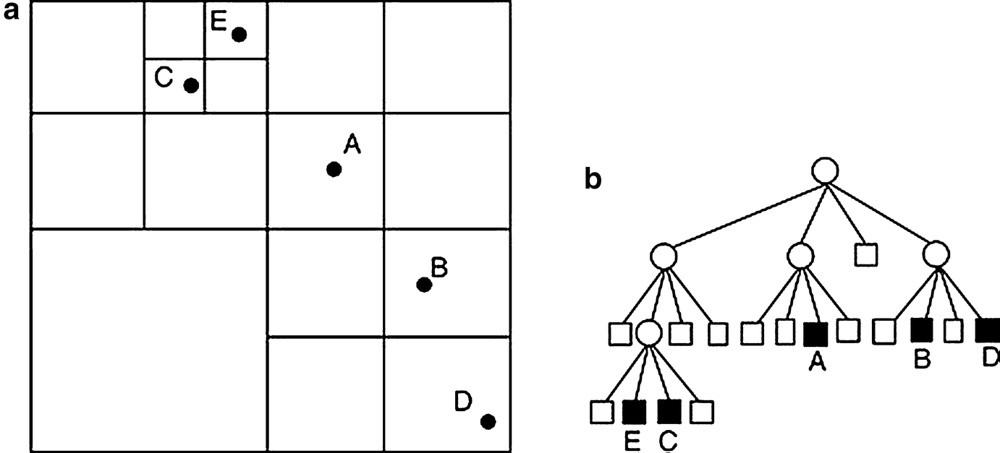

# yelp-system-design
Let's design a Yelp like service, where users can search for nearby places like restaurants, theaters, or shopping malls, etc., and can also add/view reviews of places.

Have a look at the Requirements :
# Functional Requirement

Functional Requirements:

- Search all nearby places(point of interest) within a given radius.
- Add/delete/update Places.
- Add feedback/review about a place. The feedback may have pictures, text, and a rating.

# Non Functional Requirements
- Real-time search experience with minimum latency.
- Search should be scalable.

# Scalability Requirements:
- Yelp is search heavy system. A lot of search is happening every second compared to the insert/update.

# Basic Design and Database

## DB Design

## System APIs

1. Search Places:

    search(api_dev_key, search_terms, user_location, radius_filter, maximum_results_to_return, 
    category_filter, sort, page_token)

2. Add Places:

3. Add reviews:

We will foucus on the core service for Yelp which is search API.

## Basi SQL solution 

Let us firsd solve this for 1 data. Following SQL can give us the desired result.

    Select * from Places where Latitude between X-D and X+D and Longitude between Y-D and Y+D

Now, let us discuss whether this solution works fine as the number of user grows and number of places grow.

## Issues with SQL Solution:

Considering our scale 400 Million places, this query will not be efficient for such a mammoth load as we have two separate indexes and each index can return a huge list of places and performing an intersection on these two lists will be slow.

Indexing on langitude and longitude is not efficient. 

Unnecessary table scan.

We will focus to tackle these issue and try to make the search faster.

# Scalable Design

Let us understand the world and world map in a software way.

Geohash:

Lets zoom in further to the block 9

And further more to the block 9v

# Design with Geohash concept

Whole world is divided into grids and a has function is defined which will give the gridid based upon the cordinates of a point.

Now, in addition to storing the longitude and latitude of a place, a gridid will also be stored.

How to design a grid id for Yelp:

Design a hash function such that hash(long, lat) = gridid.

Now the search query looks like this:

    Select * from Places where Latitude between X-D and X+D and Longitude between Y-D and Y+D and GridID in (GridID, GridID1, GridID2, ..., GridID8)

Index on columng gridid will make this query fast.

Is this an optimal solution ? Can we optimized it further.

Issue : Since the grid size is fixed , Some grid will be crowded with places(i.e. NYC Downtown) and some grids are having no places at all(Ocean and Forest).

# Dynamic size grids 

Two grid of same area is not a similar grid for Yelp design.

Two grid with same number of point of interest is same kind of grid.

Consider the whole world as a single grid : 0
Hash function would be : hash(x,y) = 0

If there are more than 500(limit number) then divide this grid into 4 grids and redefine the hash function.

What is the meaning of dividing one grid into 4 grids :

Define a Hash function, now if a point is given, the hash function would return one of the child node address based upon the point location.

So for given (lat, long), a hash function at each layer will find the correct grid address for user.

Same concept is used when adding a new point of interest. 
- Perform Hash function at each layer for the given point.
- Continue until its not a leaf node.
- Add the new place in that grid.
- If grid has more than 500 point of interest after adding new place, perfrom the split of the grid into 4 grids.

Now the world looks like this:

Reverse Indexing: We can store the reverse indexing to store all the location falling into a grid.

    Grid 1 : loc1, loc2.....locn
    Grid 2 : loc1, loc2.....locn

A Grid with max 1 place, its quad tree and the reverse index.

Neighboring grid needs to be found.

- Nodes on Quad tree can keep address of parent.
- Find sibling by going to parent node and then other children.

# Ranking
How about if we want to rank the search results not just by proximity but also by popularity or relevance?

Get serach result and then sort as per popularity.

# References

https://www.youtube.com/watch?v=tu6QKpV7GiI

https://www.youtube.com/watch?v=UaMzra18TD8
